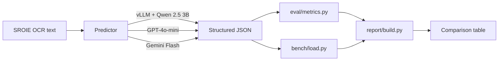
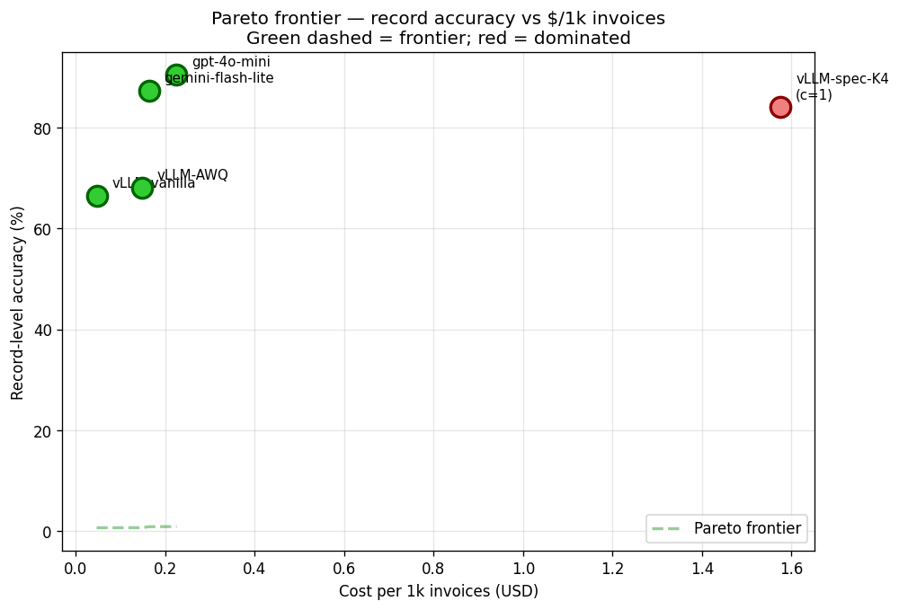

# InferLab

Self-hosted, latency-optimized inference service for structured invoice extraction.
Demonstrates inference engineering: vLLM serving, schema-constrained decoding,
benchmarking against frontier APIs, and (Part B) quantization + speculative decoding.

> **Status:** Parts A + B complete. Part B headline: only continuous batching helped on A100 (+12× throughput). AWQ INT4 and speculative decoding both *hurt* by 2–3× latency on this hardware — see [Part B: Optimization results](#part-b-optimization-results).

## Problem

Given OCR'd text from a scanned invoice, return structured JSON:

```json
{
  "vendor_name": "...",
  "invoice_number": "...",
  "invoice_date": "YYYY-MM-DD",
  "total_amount": 123.45,
  "currency": "USD",
  "line_items": [
    {"description": "...", "quantity": 1, "unit_price": 0.0, "amount": 0.0}
  ]
}
```

Output must conform to the schema. Schema validity is itself a tracked metric.

## Architecture



## Comparison table

> Two of three rows populated; vLLM Qwen 3B fills in after step 7. Throughput @ 16 is the load-bench column (step 8). See [How to reproduce](#how-to-reproduce).
>
> Eval set: 125 invoices from SROIE 2019 (deterministic 80/20 split, seed 42).
> SROIE ground truth covers vendor / date / total only — field accuracy is on those three fields.

| Predictor                       | Schema Valid | Field Acc | Record Acc | p50 lat | p99 lat | Throughput          | $/1k       |
|---------------------------------|--------------|-----------|------------|---------|---------|---------------------|------------|
| `vllm-Qwen_Qwen2.5-3B-Instruct` | 100.0%       | 87.7%     | 66.4%      | 1.15 s  | 4.15 s  | 7.95 req/s @ c=16 ¹ | $0.052 ²   |
| `gemini-gemini-2.5-flash-lite`  | 100.0%       | 95.7%     | 87.2%      | 1.53 s  | 8.70 s  | 2.62 req/s @ c=4 ³  | $0.163 ⁴   |
| `openai-gpt-4o-mini`            | 100.0%       | 96.8%     | 90.4%      | 2.36 s  | 33.83 s | 1.21 req/s @ c=4 ³  | $0.225 ⁴   |

¹ vLLM bench is a 100-request closed-loop sweep at c=1,4,8,16,32 on a single Colab GPU. Continuous batching keeps p50 latency at 1.3–1.6 s across the entire sweep — concurrency goes 32×, tail latency degrades 5%. See `bench/results/vllm-Qwen_Qwen2.5-3B-Instruct_c*.json` for the full sweep.

² $/1k = GPU $/hr ÷ throughput. Headline figure assumes **~$1.50/hr** (e.g. L4 on a major cloud pay-as-you-go, or A100 spot). Re-run `inferlab compare --gpu-dollar-per-hr <X>` for your environment. The optimistic Colab-Pro-bounded estimate is ~$0.017.

³ API benches capped at concurrency 4 to stay rate-limit safe. Each API's actual ceiling is much higher with parallel clients — these numbers are conservative.

⁴ Frontier-API $/1k is direct token cost from each predictor's `eval/results/*.json` cost block (gpt-4o-mini and gemini-flash-lite pricing snapshotted 2026-05; sources in `eval/cost.py`).

Regenerate this table from raw results: `python -m cli.main compare`. It writes both Markdown (drop-in for this README) and JSON (for downstream tools) to `report/output/comparison.{md,json}`.

Per-field breakdown:

| Predictor                 | vendor_name | invoice_date | total_amount | hallucination |
|---------------------------|-------------|--------------|--------------|---------------|
| vLLM Qwen 2.5 3B-Instruct | 86.4%       | 92.8%        | 84.0%        | 6.2%          |
| openai-gpt-4o-mini        | 93.6%       | 99.2%        | 97.6%        | 5.3%          |
| gemini-2.5-flash-lite     | 88.8%       | 99.2%        | 99.2%        | 5.6%          |

## Part B: Optimization results

Four inference optimizations measured against the same SROIE eval set
and bench harness from Part A, in isolation. Hardware: **A100 80 GB**
(Colab Pro+). Each experiment lives at `experiments/<NN>_<name>/` with
its own README, run.sh, results.json, and verdict.

> **Headline finding**: only continuous batching helped on this hardware.
> The other two optimizations we tested (AWQ INT4, speculative decoding)
> both *hurt* by 2–3× latency. **Why**: A100's BF16 tensor cores are so
> capable that adding any complexity (INT4 dequant, draft model overhead)
> costs more than it saves for a small (3B) model at our input lengths.
> The optimizations would land differently on memory-bandwidth-bound or
> compute-saturated configurations — see "What didn't work" below.

### Pareto frontier — record accuracy vs $/1k invoices



| Config              | record_acc | $/1k    | throughput      | status     |
|---------------------|-----------:|--------:|-----------------|------------|
| `vLLM-vanilla`      | 66.4%      | $0.047  | 8.96 r/s @ c=16 | frontier   |
| `vLLM-AWQ`          | 68.0% †    | $0.149  | 2.81 r/s @ c=16 | frontier † |
| `gemini-flash-lite` | 87.2%      | $0.163  | 2.62 r/s @ c=4  | frontier   |
| `gpt-4o-mini`       | 90.4%      | $0.225  | 1.21 r/s @ c=4  | frontier   |
| `vLLM-spec-K4`      | 84.0% ‡    | $1.576  | 0.26 r/s @ c=1  | dominated  |

† AWQ's 1.6pp record-accuracy advantage over vanilla is **within
statistical noise on 125 records** — per-field accuracy is identical
to four decimal places. AWQ's frontier position is marginal at best.

‡ Spec-K4's record accuracy is on a 25-record subset (cheapest middle
of the K curve). Spec dec is mathematically exact, so output matches
vanilla on the same records — the 84.0% reflects subset-selection
variance, not a quality shift.

The Pareto frontier shape is **vLLM-vanilla → gemini-flash-lite →
gpt-4o-mini**: each step up the quality axis costs roughly 3× more.
Self-hosted Qwen 3B is the cheapest option (~3.4× cheaper than
gemini-flash-lite); the frontier APIs buy higher accuracy at higher
cost. Cost numbers assume **$1.50/hr GPU** for self-hosted; at Colab
Pro shared-compute rates the self-hosted $/1k drops to ~$0.014.

### Per-technique impact

| Technique | Latency Δ | Throughput Δ | Quality Δ | Verdict |
|---|---|---|---|---|
| Continuous batching (vs serial `max_num_seqs=1`) | — | **+1104%** | +0.0pp | **Helped massively** — +12× throughput at c=16 |
| AWQ INT4 quantization | **+230%** | −69% | +1.6pp † | **Hurt** — A100 has no native INT4 tensor cores; dequant overhead dominates with no offsetting savings |
| Speculative decoding (K=4, draft=Qwen-0.5B) | **+191%** | −62% | +0.0pp ‡ | **Hurt** — draft model overhead exceeds acceptance benefit on A100; schema-constrained decoding may also lower acceptance rate |

† Within statistical noise (see Pareto note above).
‡ Mathematically exact.

### What didn't work, and why

**AWQ INT4 caused a 3× latency regression.**
- A100 has top-tier BF16 tensor cores. AWQ INT4 weights have to be
  dequantized to BF16 *just before each matmul* — there are no native
  INT4 tensor cores on Ampere.
- The expected wins (smaller VRAM, fitting bigger models, freeing KV
  cache) require memory boundaries we don't hit. Step 2's KV cache
  instrumentation showed Qwen 3B + 80 GB A100 + our input lengths
  uses 0.2–0.5% of cache. Far from any pressure.
- AWQ pays off on **H100 / RTX 4090** (native INT4 ops) or on
  **smaller GPUs** where weight bytes meaningfully reduce KV-cache
  pressure.

**Speculative decoding caused a 2–3× latency regression at every K (2, 4, 8).**
- The draft model's per-step cost exceeds the acceptance benefit. Spec
  dec helps when the *target* is the bottleneck — typically because
  weight reads dominate. On A100 + small target, target compute is so
  cheap that draft overhead is pure cost.
- **Monotonic worsening with K is the smoking gun**: if acceptance rate
  were high enough to offset overhead, throughput would rise then plateau.
  We see straight degradation, meaning the marginal accepted token
  doesn't pay back its draft+verify cost across the entire K range.
- Schema-constrained decoding may also lower acceptance rate — the draft
  was trained on free-form outputs, not constrained ones.
- Spec dec pays off on **larger target models** (7B+, where per-token
  target cost is high enough to amortize draft overhead) or on
  **memory-bandwidth-bound GPUs**.

### Skipped from the original plan

- **FP8 quantization**: deferred. After AWQ's 3× regression on A100, FP8
  was unlikely to recover — same hardware-mismatch principle. vLLM's
  FP8 support has known integration friction across versions; not worth
  burning GPU time without a stronger hypothesis.
- **Composed "InferLab Optimized" config (step 5)**: skipped because the
  composable wins didn't materialize. Continuous batching is already on
  by default in vanilla; AWQ and spec dec hurt; nothing to combine.
- **KV cache instrumentation conclusions don't apply to A100 + Qwen 3B**.
  The hypothesis ("cache-bound, quantization frees room") would have
  been true on smaller hardware. Documented in [experiments/02_kv_cache/](experiments/02_kv_cache/) as a characterization, not a win.

### Reproduce Part B

Each experiment self-contained:

```bash
bash experiments/01_continuous_batching/run.sh   # ~25 min A100
python experiments/02_kv_cache/run.py            # ~5 min (vLLM must be running)
bash experiments/03_quantization/run.sh          # ~15 min A100
bash experiments/04_speculative_decoding/run.sh  # ~10 min A100
```

Final analysis (no GPU):

```bash
python report/pareto.py --gpu-dollar-per-hr 1.50
python report/per_technique.py
```

Outputs land in `report/output/`. Both scripts read `eval/results/*.json`
and `bench/results/*.json` — no state hidden in the scripts.

## How to reproduce

### Local (data prep + frontier-API baselines, no GPU)

```bash
make install
cp .env.example .env  # fill in OPENAI_API_KEY, GEMINI_API_KEY
make data             # download SROIE, build train/eval JSONL
make test             # eval-metric unit tests
make eval-baselines   # ~$3-5 in API costs
```

### Colab (vLLM serving + GPU benchmarks)

**Runtime**: Colab Pro **L4 (24 GB)** is the recommended target. T4 (16 GB free tier) works for low concurrency but tight on KV cache; A100 (40 GB) leaves loads of headroom.

#### Cell 1 — clone + install (~3 min)

```bash
!git clone https://github.com/<you>/InferLab.git
%cd InferLab
!pip install -q -r requirements-vllm.txt
```

#### Cell 2 — build the dataset if not already in the repo (~30 s, cached)

```bash
!python -m data.build_dataset
```

#### Cell 3 — start the vLLM server (background; cell returns)

```bash
!nohup bash service/run.sh > vllm.log 2>&1 &
!sleep 90 && tail -20 vllm.log    # boot takes ~60-90s for the first model download
```

Wait for `Application startup complete` in `vllm.log`. Then verify:

```bash
!curl -s http://localhost:8000/v1/models | python -m json.tool
```

You should see `Qwen/Qwen2.5-3B-Instruct` listed.

#### Cell 4 — sanity check on 5 invoices (step 6)

```bash
!python -m cli.main eval vllm --limit 5
```

Expect 100% schema validity and accuracy ≥ 80% on the 5-record sample. If schema validity drops, the `guided_json` path isn't engaging — check the vLLM version and the server log.

#### Cell 5 — full eval (step 7)

```bash
!python -m cli.main eval vllm
```

Writes `eval/results/vllm-Qwen_Qwen2.5-3B-Instruct.json`.

#### Cell 6 — load benchmark (step 8)

```bash
!python -m cli.main bench --concurrency 1,4,8,16,32
```

#### Cell 7 — build the comparison table (step 9)

```bash
!python -m cli.main compare
```

#### Tunables (env vars; defaults in [service/vllm_server.py](service/vllm_server.py))

| Var                  | Default                       | Notes                                              |
|----------------------|-------------------------------|----------------------------------------------------|
| `VLLM_MODEL`         | `Qwen/Qwen2.5-3B-Instruct`    | HF model id                                        |
| `VLLM_PORT`          | `8000`                        |                                                    |
| `VLLM_MAX_MODEL_LEN` | `4096`                        | Our inputs are <500 tokens; 4 K is generous        |
| `VLLM_GPU_MEM_UTIL`  | `0.85`                        | Drop to `0.75` on T4 if the model OOMs at boot     |
| `VLLM_DTYPE`         | `auto`                        | `bfloat16` on Ampere+, `float16` elsewhere         |

## Repo layout

```
data/        SROIE download + schema-mapped train/eval JSONL
service/     vLLM server config + Dockerfile + run.sh
baselines/   OpenAI + Gemini callers (frontier-API comparators)
eval/        Schema validity, field accuracy, hallucination metrics
bench/       Async load generator (concurrency sweep, p50/p95/p99)
report/      Aggregates eval + bench into the comparison table
cli/         `inferlab extract|bench|eval|compare` entry points
tests/       Unit tests for metrics, schema, data pipeline
```

## What's next

Part B's negative findings (AWQ, spec dec hurt on A100) point at specific
hardware/model regimes worth testing in a Part C:

- **Re-run AWQ + spec dec on a smaller GPU** (L4 24 GB, T4 16 GB).
  Confirm the predicted reversal where weight bytes pressure KV cache
  and target weight reads dominate.
- **Try Qwen 2.5 7B (BF16 or AWQ) on A100**. The accuracy floor of 3B
  is the real blocker (66% record acc vs 90% for gpt-4o-mini); a
  larger model is the right fix, not kernel-level optimization on the
  3B.
- **Migrate Gemini caller to `google-genai` SDK**. The deprecated
  `google-generativeai` rejected `thinking_config`; couldn't measure
  full Gemini Flash without thinking. The new SDK would unlock
  `gemini-2.5-flash` (no thinking) as a separate frontier-API row.
- **Confidence intervals on the eval metrics**. With only 125 records,
  per-field deltas of a few points sit within noise (the AWQ "frontier"
  position in Part B is a clean example). Bootstrap CIs would make
  ±-pp claims defensible at the per-percentage level.
- **Long-context stress test**. KV cache instrumentation in step 2
  ran at our SROIE input sizes (avg ~500-1400 tokens). Pushing to 8k+
  tokens would actually pressure cache and let us re-test AWQ where
  it should pay off.

## Limitations

Concrete gaps in what's measured here. Honest framing matters more than a clean story.

**Eval coverage (data side)**
- SROIE ground truth covers only **vendor / date / total** (3 of the 6 schema fields).
  `invoice_number`, `currency`, `line_items` are predicted but **not scored against ground truth** — only checked against the OCR text by the hallucination metric. Anyone reading the table should not over-interpret a 96.8% field-accuracy number as full-schema accuracy.
- 125-record eval set. Big enough for the headline numbers but small enough that
  per-field deltas of a few points are within noise. Confidence intervals not reported.
- SROIE is **Malaysian retail receipts only**. B2B invoices, multi-currency
  documents, and longer line-itemized invoices are out of distribution.
- Hallucination metric uses **substring matching after normalization**.
  Numerical values can match by coincidence (e.g. predicted total `99.0` is
  "grounded" if vendor name is `99 SPEED MART`). The metric is therefore an
  **upper bound on faithfulness** — model can be more hallucinated than reported,
  not less. Documented in [eval/metrics.py](eval/metrics.py).

**Bench coverage (latency / throughput)**
- vLLM throughput is **single Colab GPU only** — multi-GPU production setups
  with tensor or pipeline parallelism would scale further but aren't tested.
- Frontier API benches capped at **concurrency 4** (rate-limit safety on a fresh
  account). Their actual throughput ceiling with parallel clients is much higher
  — a `n/a` in the throughput column doesn't mean "API is slow", just "not
  measured at meaningful saturation".
- Latency comparison is **apples-to-oranges in the absolute**: vLLM is local
  (no network leg); APIs include network round-trip. The shape of the
  relationship (vLLM tighter p99, lower per-request cost) is what's meaningful,
  not the raw millisecond gap.

**Cost numbers**
- Frontier-API $/1k uses **token cost only** (no overhead, no per-request fee
  surcharges) at the 2026-05 published rates in [eval/cost.py](eval/cost.py).
- Self-hosted $/1k for vLLM is **GPU $/hr ÷ throughput**. Headline figure
  assumes ~$1.50/hr (mid-tier cloud); the same setup on Colab Pro shared
  compute is closer to ~$0.017/1k. Full-stack production cost (storage,
  network egress, SRE time) is ignored.

**Engineering choices deferred**
- Gemini caller still uses the **deprecated `google-generativeai` SDK**. Works
  for now; migration to `google-genai` is parked because Part A doesn't need
  features (like `thinking_config`) that only the new SDK exposes.
- vLLM caller falls back to OpenAI-style `response_format`; the older
  `extra_body={"guided_json": ...}` path is dead in vLLM 0.12+ and would have
  silently emitted free-form output if not caught (it was, during the step 6
  sanity check — see commit history).
- No fine-tuning, no prompt-search, no few-shot examples. Part A intentionally
  measures the out-of-the-box model so Part B's optimizations have a clean baseline.

**Part B coverage**
- All Part B experiments ran on **A100 80 GB**. The verdicts (which
  optimizations help / hurt) are hardware-specific. Smaller GPUs (T4, L4)
  would likely show AWQ as a help (KV-cache pressure) and spec dec as
  more competitive (target weight reads dominate). Larger models (7B+)
  on the same hardware would also shift the verdict.
- AWQ vs spec-dec measurements were taken at **narrow concurrency points**
  (c=1, c=16; spec dec only at c=1) per the step-3 / step-4 trim plan.
  Full concurrency sweeps would add precision but not change the verdict
  given the magnitude of the regressions (2–3×).
- **Acceptance rate for speculative decoding was not captured** — vLLM
  0.20.x metric naming differs from earlier versions and our regex didn't
  match. Raw `/metrics` snapshots are saved at
  `experiments/04_speculative_decoding/metrics-spec-K*.txt` for post-hoc
  inspection if anyone wants to extend the regex and recompute.
- **Step 5 (composed "InferLab Optimized" config) was intentionally
  skipped.** Continuous batching is already on by default; the other two
  optimizations hurt; there was nothing to compose. Documented in the
  "Skipped from the original plan" section above.
