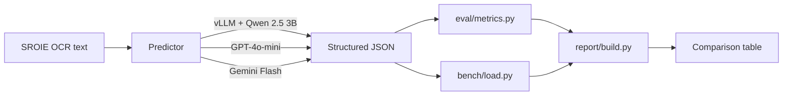

# InferLab

Self-hosted, latency-optimized inference service for structured invoice extraction.
Demonstrates inference engineering: vLLM serving, schema-constrained decoding,
benchmarking against frontier APIs, and (Part B) quantization + speculative decoding.

> **Status:** Part A — working baseline + first measurements. See [Part B](#whats-next-part-b) for upcoming optimizations.

## Problem

Given OCR'd text from a scanned invoice, return structured JSON:

```json
{
  "vendor_name": "...",
  "invoice_number": "...",
  "invoice_date": "YYYY-MM-DD",
  "total_amount": 123.45,
  "currency": "USD",
  "line_items": [
    {"description": "...", "quantity": 1, "unit_price": 0.0, "amount": 0.0}
  ]
}
```

Output must conform to the schema. Schema validity is itself a tracked metric.

## Architecture



## Comparison table

> Two of three rows populated; vLLM Qwen 3B fills in after step 7. Throughput @ 16 is the load-bench column (step 8). See [How to reproduce](#how-to-reproduce).
>
> Eval set: 125 invoices from SROIE 2019 (deterministic 80/20 split, seed 42).
> SROIE ground truth covers vendor / date / total only — field accuracy is on those three fields.

| Predictor                       | Schema Valid | Field Acc | Record Acc | p50 lat | p99 lat | Throughput          | $/1k       |
|---------------------------------|--------------|-----------|------------|---------|---------|---------------------|------------|
| `vllm-Qwen_Qwen2.5-3B-Instruct` | 100.0%       | 87.7%     | 66.4%      | 1.15 s  | 4.15 s  | 7.95 req/s @ c=16 ¹ | $0.052 ²   |
| `gemini-gemini-2.5-flash-lite`  | 100.0%       | 95.7%     | 87.2%      | 1.53 s  | 8.70 s  | 2.62 req/s @ c=4 ³  | $0.163 ⁴   |
| `openai-gpt-4o-mini`            | 100.0%       | 96.8%     | 90.4%      | 2.36 s  | 33.83 s | 1.21 req/s @ c=4 ³  | $0.225 ⁴   |

¹ vLLM bench is a 100-request closed-loop sweep at c=1,4,8,16,32 on a single Colab GPU. Continuous batching keeps p50 latency at 1.3–1.6 s across the entire sweep — concurrency goes 32×, tail latency degrades 5%. See `bench/results/vllm-Qwen_Qwen2.5-3B-Instruct_c*.json` for the full sweep.

² $/1k = GPU $/hr ÷ throughput. Headline figure assumes **~$1.50/hr** (e.g. L4 on a major cloud pay-as-you-go, or A100 spot). Re-run `inferlab compare --gpu-dollar-per-hr <X>` for your environment. The optimistic Colab-Pro-bounded estimate is ~$0.017.

³ API benches capped at concurrency 4 to stay rate-limit safe. Each API's actual ceiling is much higher with parallel clients — these numbers are conservative.

⁴ Frontier-API $/1k is direct token cost from each predictor's `eval/results/*.json` cost block (gpt-4o-mini and gemini-flash-lite pricing snapshotted 2026-05; sources in `eval/cost.py`).

Regenerate this table from raw results: `python -m cli.main compare`. It writes both Markdown (drop-in for this README) and JSON (for downstream tools) to `report/output/comparison.{md,json}`.

Per-field breakdown:

| Predictor                 | vendor_name | invoice_date | total_amount | hallucination |
|---------------------------|-------------|--------------|--------------|---------------|
| vLLM Qwen 2.5 3B-Instruct | 86.4%       | 92.8%        | 84.0%        | 6.2%          |
| openai-gpt-4o-mini        | 93.6%       | 99.2%        | 97.6%        | 5.3%          |
| gemini-2.5-flash-lite     | 88.8%       | 99.2%        | 99.2%        | 5.6%          |

## How to reproduce

### Local (data prep + frontier-API baselines, no GPU)

```bash
make install
cp .env.example .env  # fill in OPENAI_API_KEY, GEMINI_API_KEY
make data             # download SROIE, build train/eval JSONL
make test             # eval-metric unit tests
make eval-baselines   # ~$3-5 in API costs
```

### Colab (vLLM serving + GPU benchmarks)

**Runtime**: Colab Pro **L4 (24 GB)** is the recommended target. T4 (16 GB free tier) works for low concurrency but tight on KV cache; A100 (40 GB) leaves loads of headroom.

#### Cell 1 — clone + install (~3 min)

```bash
!git clone https://github.com/<you>/InferLab.git
%cd InferLab
!pip install -q -r requirements-vllm.txt
```

#### Cell 2 — build the dataset if not already in the repo (~30 s, cached)

```bash
!python -m data.build_dataset
```

#### Cell 3 — start the vLLM server (background; cell returns)

```bash
!nohup bash service/run.sh > vllm.log 2>&1 &
!sleep 90 && tail -20 vllm.log    # boot takes ~60-90s for the first model download
```

Wait for `Application startup complete` in `vllm.log`. Then verify:

```bash
!curl -s http://localhost:8000/v1/models | python -m json.tool
```

You should see `Qwen/Qwen2.5-3B-Instruct` listed.

#### Cell 4 — sanity check on 5 invoices (step 6)

```bash
!python -m cli.main eval vllm --limit 5
```

Expect 100% schema validity and accuracy ≥ 80% on the 5-record sample. If schema validity drops, the `guided_json` path isn't engaging — check the vLLM version and the server log.

#### Cell 5 — full eval (step 7)

```bash
!python -m cli.main eval vllm
```

Writes `eval/results/vllm-Qwen_Qwen2.5-3B-Instruct.json`.

#### Cell 6 — load benchmark (step 8)

```bash
!python -m cli.main bench --concurrency 1,4,8,16,32
```

#### Cell 7 — build the comparison table (step 9)

```bash
!python -m cli.main compare
```

#### Tunables (env vars; defaults in [service/vllm_server.py](service/vllm_server.py))

| Var                  | Default                       | Notes                                              |
|----------------------|-------------------------------|----------------------------------------------------|
| `VLLM_MODEL`         | `Qwen/Qwen2.5-3B-Instruct`    | HF model id                                        |
| `VLLM_PORT`          | `8000`                        |                                                    |
| `VLLM_MAX_MODEL_LEN` | `4096`                        | Our inputs are <500 tokens; 4 K is generous        |
| `VLLM_GPU_MEM_UTIL`  | `0.85`                        | Drop to `0.75` on T4 if the model OOMs at boot     |
| `VLLM_DTYPE`         | `auto`                        | `bfloat16` on Ampere+, `float16` elsewhere         |

## Repo layout

```
data/        SROIE download + schema-mapped train/eval JSONL
service/     vLLM server config + Dockerfile + run.sh
baselines/   OpenAI + Gemini callers (frontier-API comparators)
eval/        Schema validity, field accuracy, hallucination metrics
bench/       Async load generator (concurrency sweep, p50/p95/p99)
report/      Aggregates eval + bench into the comparison table
cli/         `inferlab extract|bench|eval|compare` entry points
tests/       Unit tests for metrics, schema, data pipeline
```

## What's next: Part B

The accuracy gap (vLLM 66% record acc vs 87-90% for frontier APIs) is the
target. Optimizations to come, with eval re-runs after each:

- **Continuous batching analysis** — measure GPU utilization + KV-cache
  occupancy across concurrency. The c=16→32 efficiency drop (73% → 53%)
  suggests we're hitting the L4's compute ceiling; nailing down whether
  it's compute, memory bandwidth, or scheduler overhead would tell us
  whether more concurrency is worth it.
- **AWQ / GPTQ 4-bit quantization** — should cut weight-bytes 4× (Qwen 3B
  6 GB → ~1.5 GB), opening ~6 GB more for KV cache → higher max
  concurrency. Track accuracy delta on the 125-record eval.
- **Speculative decoding** — draft model + Qwen 3B verifier. Track
  acceptance rate and throughput delta.
- **Larger / better-tuned model** — Qwen 2.5 7B on the same L4 (with
  quant) is the right experiment if 3B's accuracy floor is the
  blocker rather than the engineering.

## Limitations

Concrete gaps in what's measured here. Honest framing matters more than a clean story.

**Eval coverage (data side)**
- SROIE ground truth covers only **vendor / date / total** (3 of the 6 schema fields).
  `invoice_number`, `currency`, `line_items` are predicted but **not scored against ground truth** — only checked against the OCR text by the hallucination metric. Anyone reading the table should not over-interpret a 96.8% field-accuracy number as full-schema accuracy.
- 125-record eval set. Big enough for the headline numbers but small enough that
  per-field deltas of a few points are within noise. Confidence intervals not reported.
- SROIE is **Malaysian retail receipts only**. B2B invoices, multi-currency
  documents, and longer line-itemized invoices are out of distribution.
- Hallucination metric uses **substring matching after normalization**.
  Numerical values can match by coincidence (e.g. predicted total `99.0` is
  "grounded" if vendor name is `99 SPEED MART`). The metric is therefore an
  **upper bound on faithfulness** — model can be more hallucinated than reported,
  not less. Documented in [eval/metrics.py](eval/metrics.py).

**Bench coverage (latency / throughput)**
- vLLM throughput is **single Colab GPU only** — multi-GPU production setups
  with tensor or pipeline parallelism would scale further but aren't tested.
- Frontier API benches capped at **concurrency 4** (rate-limit safety on a fresh
  account). Their actual throughput ceiling with parallel clients is much higher
  — a `n/a` in the throughput column doesn't mean "API is slow", just "not
  measured at meaningful saturation".
- Latency comparison is **apples-to-oranges in the absolute**: vLLM is local
  (no network leg); APIs include network round-trip. The shape of the
  relationship (vLLM tighter p99, lower per-request cost) is what's meaningful,
  not the raw millisecond gap.

**Cost numbers**
- Frontier-API $/1k uses **token cost only** (no overhead, no per-request fee
  surcharges) at the 2026-05 published rates in [eval/cost.py](eval/cost.py).
- Self-hosted $/1k for vLLM is **GPU $/hr ÷ throughput**. Headline figure
  assumes ~$1.50/hr (mid-tier cloud); the same setup on Colab Pro shared
  compute is closer to ~$0.017/1k. Full-stack production cost (storage,
  network egress, SRE time) is ignored.

**Engineering choices deferred**
- Gemini caller still uses the **deprecated `google-generativeai` SDK**. Works
  for now; migration to `google-genai` is parked because Part A doesn't need
  features (like `thinking_config`) that only the new SDK exposes.
- vLLM caller falls back to OpenAI-style `response_format`; the older
  `extra_body={"guided_json": ...}` path is dead in vLLM 0.12+ and would have
  silently emitted free-form output if not caught (it was, during the step 6
  sanity check — see commit history).
- No fine-tuning, no prompt-search, no few-shot examples. Part A intentionally
  measures the out-of-the-box model so Part B's optimizations have a clean baseline.
