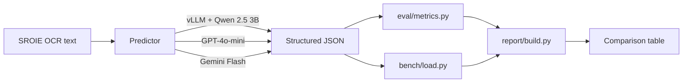

# InferLab

Self-hosted, latency-optimized inference service for structured invoice extraction.
Demonstrates inference engineering: vLLM serving, schema-constrained decoding,
benchmarking against frontier APIs, and (Part B) quantization + speculative decoding.

> **Status:** Part A — working baseline + first measurements. See [Part B](#whats-next-part-b) for upcoming optimizations.

## Problem

Given OCR'd text from a scanned invoice, return structured JSON:

```json
{
  "vendor_name": "...",
  "invoice_number": "...",
  "invoice_date": "YYYY-MM-DD",
  "total_amount": 123.45,
  "currency": "USD",
  "line_items": [
    {"description": "...", "quantity": 1, "unit_price": 0.0, "amount": 0.0}
  ]
}
```

Output must conform to the schema. Schema validity is itself a tracked metric.

## Architecture



## Comparison table

> Two of three rows populated; vLLM Qwen 3B fills in after step 7. Throughput @ 16 is the load-bench column (step 8). See [How to reproduce](#how-to-reproduce).
>
> Eval set: 125 invoices from SROIE 2019 (deterministic 80/20 split, seed 42).
> SROIE ground truth covers vendor / date / total only — field accuracy is on those three fields.

| Predictor                | Schema Valid | Field Acc (macro) | Record Acc | p50 lat  | p99 lat  | Throughput @16 | $/1k    |
|--------------------------|--------------|-------------------|------------|----------|----------|----------------|---------|
| vLLM Qwen 2.5 3B-Instruct| TBD          | TBD               | TBD        | TBD      | TBD      | TBD            | TBD     |
| openai-gpt-4o-mini       | 100.0%       | 96.8%             | 90.4%      | 2.4 s    | 33.8 s   | n/a (API)      | $0.225  |
| gemini-2.5-flash-lite    | 100.0%       | 95.7%             | 87.2%      | 1.5 s    | 8.7 s    | n/a (API)      | $0.163  |

Per-field breakdown for the populated rows:

| Predictor                | vendor_name | invoice_date | total_amount | hallucination |
|--------------------------|-------------|--------------|--------------|---------------|
| openai-gpt-4o-mini       | 93.6%       | 99.2%        | 97.6%        | 5.3%          |
| gemini-2.5-flash-lite    | 88.8%       | 99.2%        | 99.2%        | 5.6%          |

## How to reproduce

### Local (data prep + frontier-API baselines, no GPU)

```bash
make install
cp .env.example .env  # fill in OPENAI_API_KEY, GEMINI_API_KEY
make data             # download SROIE, build train/eval JSONL
make test             # eval-metric unit tests
make eval-baselines   # ~$3-5 in API costs
```

### Colab (vLLM serving + GPU benchmarks)

**Runtime**: Colab Pro **L4 (24 GB)** is the recommended target. T4 (16 GB free tier) works for low concurrency but tight on KV cache; A100 (40 GB) leaves loads of headroom.

#### Cell 1 — clone + install (~3 min)

```bash
!git clone https://github.com/<you>/InferLab.git
%cd InferLab
!pip install -q -r requirements-vllm.txt
```

#### Cell 2 — build the dataset if not already in the repo (~30 s, cached)

```bash
!python -m data.build_dataset
```

#### Cell 3 — start the vLLM server (background; cell returns)

```bash
!nohup bash service/run.sh > vllm.log 2>&1 &
!sleep 90 && tail -20 vllm.log    # boot takes ~60-90s for the first model download
```

Wait for `Application startup complete` in `vllm.log`. Then verify:

```bash
!curl -s http://localhost:8000/v1/models | python -m json.tool
```

You should see `Qwen/Qwen2.5-3B-Instruct` listed.

#### Cell 4 — sanity check on 5 invoices (step 6)

```bash
!python -m cli.main eval vllm --limit 5
```

Expect 100% schema validity and accuracy ≥ 80% on the 5-record sample. If schema validity drops, the `guided_json` path isn't engaging — check the vLLM version and the server log.

#### Cell 5 — full eval (step 7)

```bash
!python -m cli.main eval vllm
```

Writes `eval/results/vllm-Qwen_Qwen2.5-3B-Instruct.json`.

#### Cell 6 — load benchmark (step 8)

```bash
!python -m cli.main bench --concurrency 1,4,8,16,32
```

#### Cell 7 — build the comparison table (step 9)

```bash
!python -m cli.main compare
```

#### Tunables (env vars; defaults in [service/vllm_server.py](service/vllm_server.py))

| Var                  | Default                       | Notes                                              |
|----------------------|-------------------------------|----------------------------------------------------|
| `VLLM_MODEL`         | `Qwen/Qwen2.5-3B-Instruct`    | HF model id                                        |
| `VLLM_PORT`          | `8000`                        |                                                    |
| `VLLM_MAX_MODEL_LEN` | `4096`                        | Our inputs are <500 tokens; 4 K is generous        |
| `VLLM_GPU_MEM_UTIL`  | `0.85`                        | Drop to `0.75` on T4 if the model OOMs at boot     |
| `VLLM_DTYPE`         | `auto`                        | `bfloat16` on Ampere+, `float16` elsewhere         |

## Repo layout

```
data/        SROIE download + schema-mapped train/eval JSONL
service/     vLLM server config + Dockerfile + run.sh
baselines/   OpenAI + Gemini callers (frontier-API comparators)
eval/        Schema validity, field accuracy, hallucination metrics
bench/       Async load generator (concurrency sweep, p50/p95/p99)
report/      Aggregates eval + bench into the comparison table
cli/         `inferlab extract|bench|eval|compare` entry points
tests/       Unit tests for metrics, schema, data pipeline
```

## What's next: Part B

- Continuous batching analysis: throughput vs concurrency curves, KV-cache utilization
- AWQ / GPTQ quantization: 4-bit Qwen, latency + accuracy delta
- Speculative decoding: draft model + acceptance rate

## Limitations

Will be honest and specific once we have numbers. Expected items:

- SROIE ground truth lacks line items + currency, so field accuracy is partial for those fields
- vLLM benchmarks run on a single GPU (Colab A100 or L4), not a multi-GPU production setup
- Frontier-API latency includes network; vLLM latency is local — apples-to-oranges in the absolute, but useful for $ vs ms tradeoff
